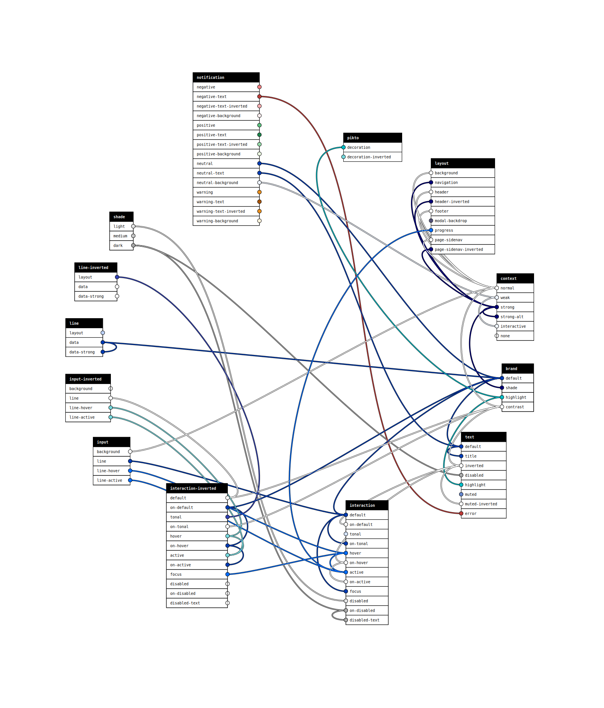

# paletter 🎨

simple JS class to manage color palettes by giving them semantic meaning
and being aware of the connections between the colors in your palettes

## Installation 💾

```bash
npm install paletter --save-dev
```

## Setup

### Define an object containing all references for color values

```javascript
const colors = {
  blue: '#00fff1',
  red: '#ff2211',
  black: '#010101',
  yellow: '#f4f142',
  darkGrey: '#212121',
  lime: '#42ff3f',
  white: '#ffffff'
};
```

### Setup your palettes

```javascript
const palettes = {
  brand: {
    logo: 'blue',
    main: 'black',
    highlight: 'lime'
  },
  typography: {
    default: 'brand__main', //optional default color
    heading: 'brand__logo', //links to palettes.brand
    title: 'brand__main',
    sub-title: 'darkGrey',
  },
  irregularity : {
    error: 'red',
    warning: 'yellow',
    notification: 'brand__highlight'
  },
  interaction: {
    default: 'brand__highlight',
    link: 'brand__logo',
    button: 'brand__highlight'
  },
  'interaction--inverted': {
    default: 'white',
  },
  layout: {
    lines: 'darkGrey'
  }
};
```

## Usage

```javascript
const palette = new Paletter(palettes, colors);

palette.get('typography'); // => returns the default color (#010101)
palette.get('irregularity__notification'); // => {value: #42ff3f, name: lime}

palette.getParsed() // will return your full palette with hex values instead of links to other items

palette.getConnections() // returns an array of all links within palettes
```

## Examples

Create CSS variables for each color:

```javascript
function objToCSSVars (obj, links) {
  let CSSvars = ':root {\n';
  for (let palette in obj) {
    let prefix = `--${palette}`;
    for (let key in obj[palette] ) {
      let color = obj[palette][key];
      const linkFromKey = links.find(c => (c.from.key == `${palette}--${key}`));
      CSSvars += `  ${prefix}-${key}: ${linkFromKey ? `var(--${linkFromKey.to.key.replace('--','-')},${color})` : color};\n`;
    }
  }
  CSSvars += '}';

  return CSSvars;
};

const connections = palette.getConnections();
const cssVars = objToCSSVars(palette.getParsed(), connections);
const $style = document.createElement('style');
$style.innerHTML = cssVars;
document.querySelector('head').appendChild($style);
```

### Will result in something like

```css
:root {
  --brand-logo: #00fff1;
  --brand-main: #010101;
  --brand-highlight: #42ff3f;
  --typography-default: var(--brand-main,#010101);
  --typography-heading: var(--brand-logo,#00fff1);
  --typography-title: var(--brand-main,#010101);
  --typography-subtitle: #212121;
  --irregularity-error: #ff2211;
  --irregularity-warning: #f4f142;
  --irregularity-notification: var(--brand-highlight,#42ff3f);
  --interaction-default: var(--brand-highlight,#42ff3f);
  --interaction-link: var(--brand-logo,#00fff1);
  --interaction-button: var(--brand-highlight,#42ff3f);
  --layout-lines: #212121;
}
```

## CLI

### usage

#### Export to CSS (including CSS variables)

```bash
node ./node_modules/.bin/paletterTo --colors ./colors.json --palettes ./palettes.json --mode css > colors.css
```

#### Export SVG Visualisation

```bash
node ./node_modules/.bin/paletterTo --colors ./colors.json --palettes ./palettes.json --mode svg > connections.svg
```



### arguments

- `colors`: path to JSON or JS returning raw colors as {name: key}
- `palettes`: path to JSON or JS returning palettes as {key: reference}
- `mode`: css, scss or html

### usage with javascript files as arguments

You can use javascript files instead of JSON files, as long as you export a javascript object like this:

```javascript
// colors.js
module.exports = {
  blue: '#00fff1'
}
```
